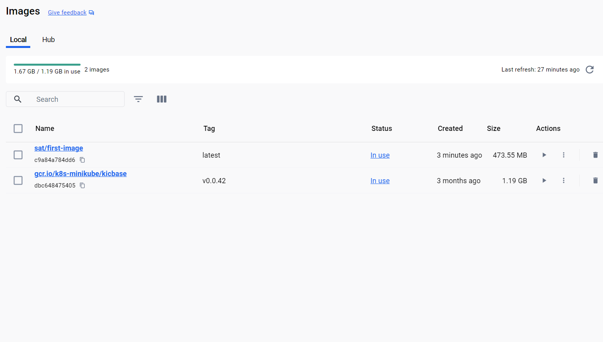

# IMPORTNAT COMMAND FOR DOCKER

## CONNECTING TO DOCKER HUB

## If not able to login on docker

 
$ winpty docker login $ACR_REGISTRY
 
Username: appacr
 
Password:
 
Login Succeeded
 

normal way:docker login -u LOGIN -p PASSWORD

## DOCKER BASIC COMMAND

### BUILD IMAGES

1.docker build -t satytechjava/first-image:latest .
  (satytechjava is the user name of dockerhub and first-image is tag)

### RUN IMAGES==CONTAINER

1.docker run sat/first-image

### PUSH IMAGE TO DOCKER HUB

1.docker push satytechjava/my-image

### DOCKER IMAGES LIST

1.docker images

