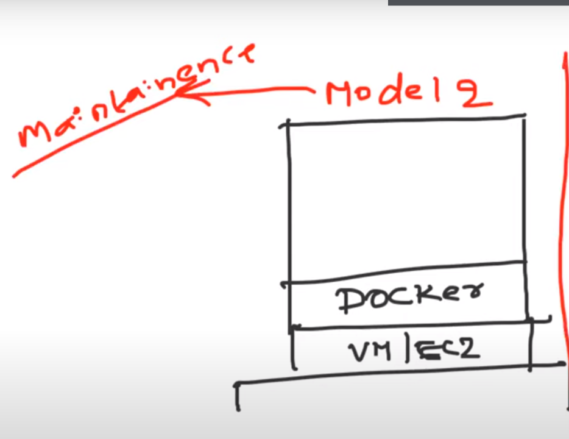
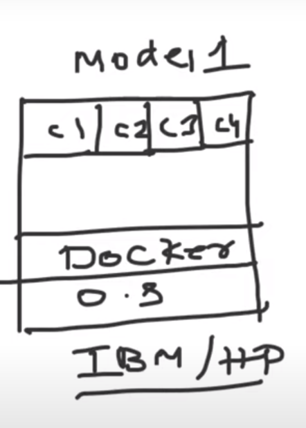
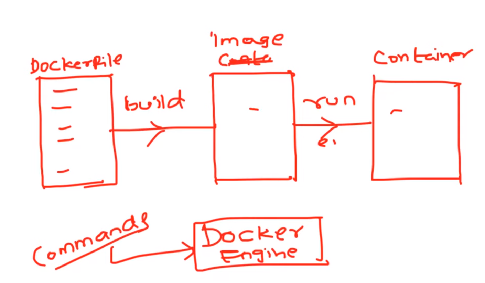

# CONTAINER VS VIRTUAL MACHINE

## Methods for Creating Containers
 

### 1.First method on the top of virtual machines(More preferred model because of less maintainece)
 

 

### 2.Second method on the top of Physical servers

 

### 3.ABOUT CONTAINERS

1.Containers are light weight in nature because they donot have full operating system
  they have shared OS from host on which conatiners are running.

  
