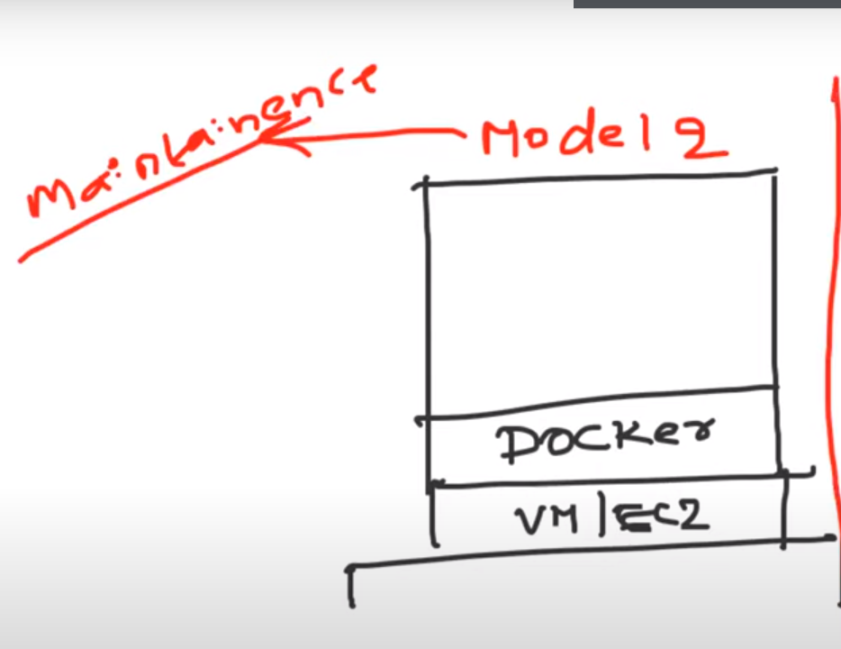
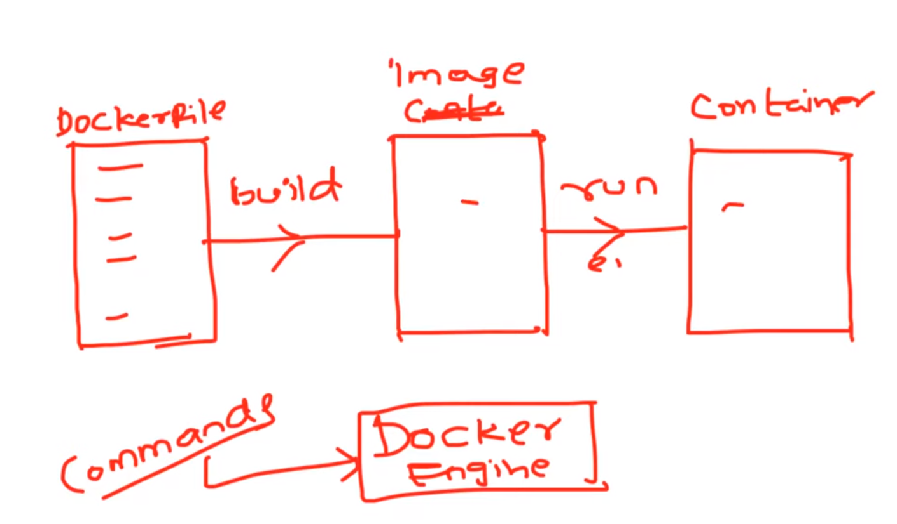

# CONTAINER VS VIRTUAL MACHINE

## Methods for Creating Containers
 

### First method on the top of virtual machines(More preferred model because of less maintainece)
 

 
### Second method on the top of Physical servers

 

### ABOUT CONATINERS

1.Containers are light weight in nature because they donot have full operating system
  they have shared OS from host on which conatiners are running.

  
