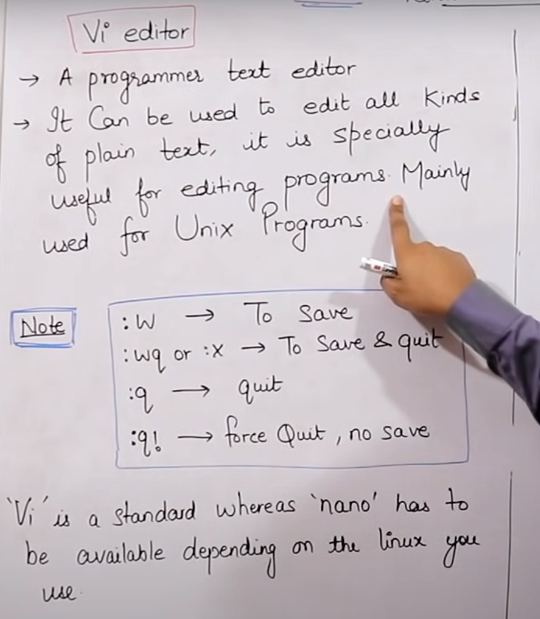

# LINUX COMMAND AND BASIC IMPLEMENTATION

## HOW TO CREATE FILE IN LINUX

### 1.cat command

#### 1.1 cat command is used to create files.
 

#### STEPS

$ cat > file1
 
then ctrl+d
 
$ ls (Created files will be shown)
 
$ cat file1 (to see the content)
 

#### 1.2 cat command is not editor once file is created its content cannot be edited but new content can be added.

#### STEPS

$ cat >> file1
 
$ cat ls
 

#### 1.3 cat command is used to concatenate files
 

#### STEPS

cat file1 file2 > file3
(Concatenation happens and new file3 will have all content )

 

#### 1.4 cat command is used to copy files 

 

#### 1.5 cat command is used to read from bottom to first
 

#### STEPS
 

tac file1

### 2.touch command (For changing timestamp)
 

### 3.vi/vim command(IT IS EDITOR ALSO)
 

#### STEPS FOR USING vi/vim commands

 
vim file1
 
press i in keyboard
 
add text or edit text
 
press esc
 
then press :wq
 

### 4.nano command
 

#### STEPS

nano file2
 
write or edit
 
ctrl x
 
shift+y
 
enter
 