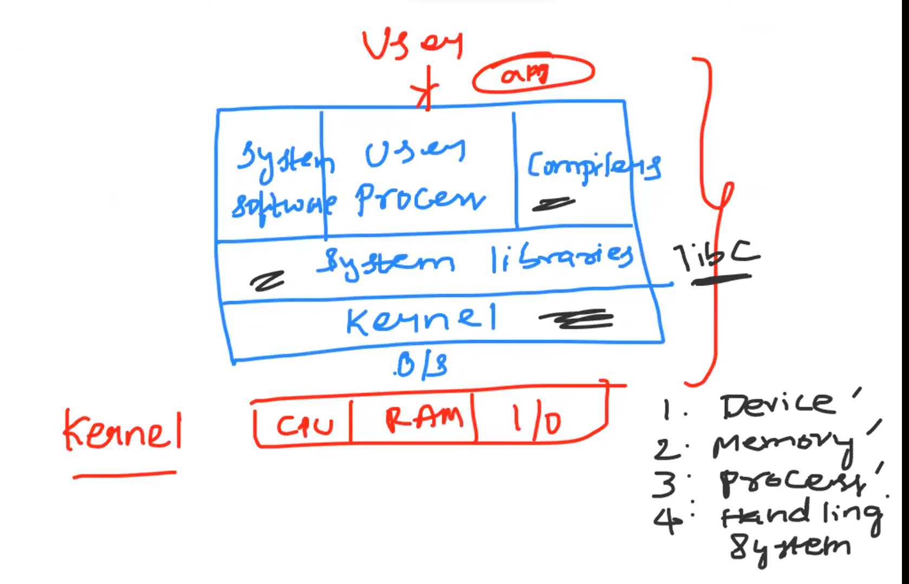

# LINUX AND SHELL SCRIPTING BASIC

### OPERATING SYSTEM
 

1.An operating system (OS) is a software program that serves as an intermediary between computer hardware and user applications.

 

2.The primary functions of an operating system include managing memory, scheduling tasks, controlling peripheral devices.
 

3.providing a user interface, facilitating communication between software and hardware components

## LINUX PREFRENCE ON OTHER OPERATING SYSTEM

### Feature of LINUX

 

1.Free 
 

2.Open source
 

3.Secure
 

4.Distribution like alpine,centos,ubuntu
 

5.Fast
 

### kernel is acting Bridge between Hardware and Software

