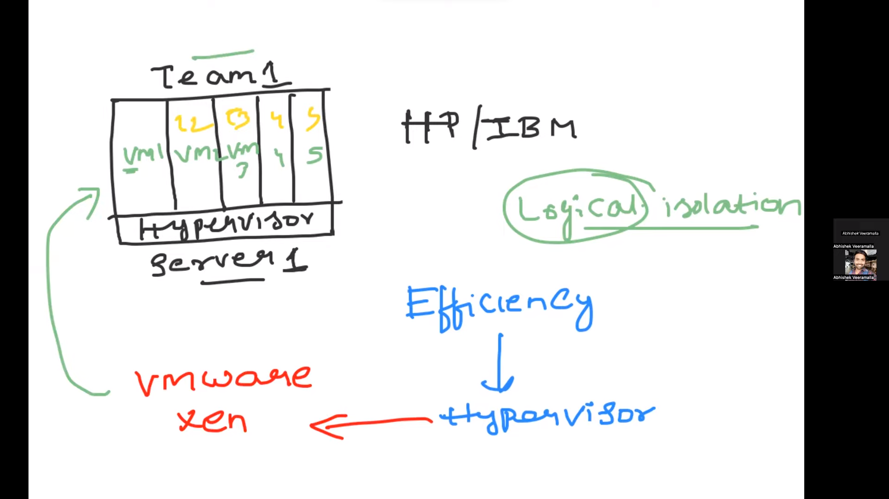

# VIRTUAL MACHINE IMPORTANCE
 
1.Devops is basically used for utilizing the resources

## SERVER
 

1.A server is a computer or software program that provides functionality or services to other computers or programs, known as clients, over a network. Servers are designed to handle and respond to requests from clients by providing access to resources, such as files, data, applications, or services. 
 

2.Servers can serve various purposes, including hosting websites, managing email, storing and sharing files, running databases, providing gaming services, and more.

 

## PROBLEM WITHOUT VIRTUALISATION

 

1.Without virtualisation earlier when something was hosted on the server properly resources were
  not utilized and inefficiency was observed.

  