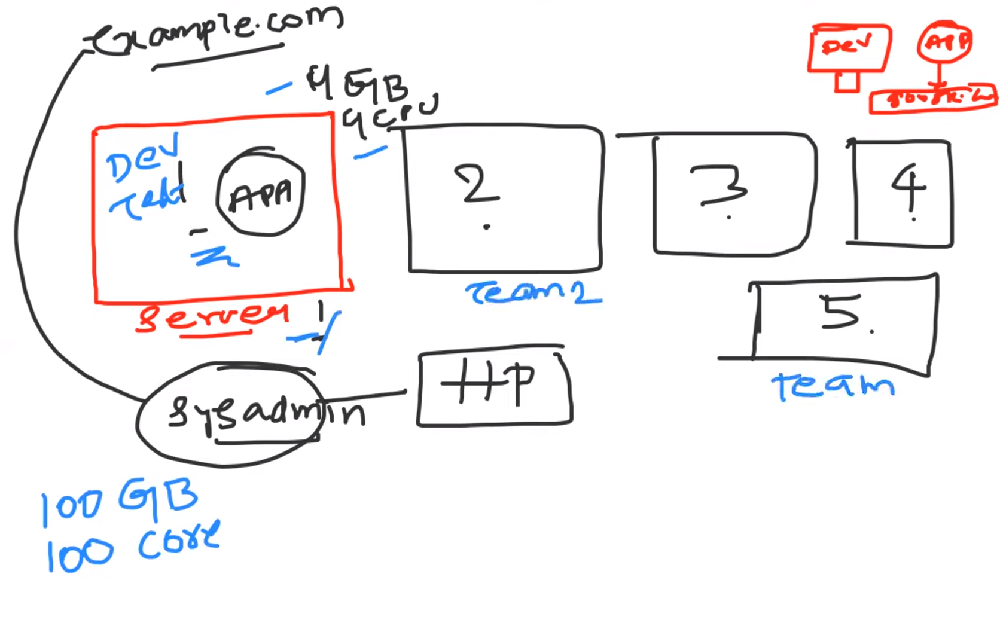
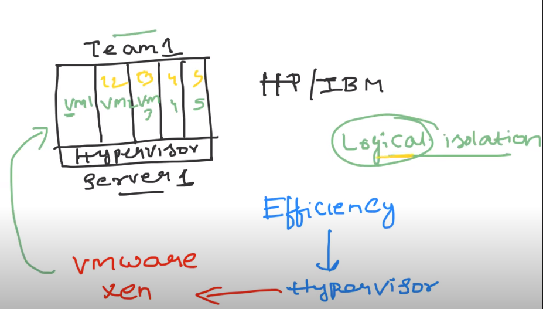

# VIRTUAL MACHINE IMPORTANCE
 
1.Devops is basically used for utilizing the resources

## SERVER
 

1.A server is a computer or software program that provides functionality or services to other computers or programs, known as clients, over a network. Servers are designed to handle and respond to requests from clients by providing access to resources, such as files, data, applications, or services. 
 

2.Servers can serve various purposes, including hosting websites, managing email, storing and sharing files, running databases, providing gaming services, and more.

 

## PROBLEM WITHOUT VIRTUALISATION

 

1.Without virtualisation earlier when something was hosted on the server properly resources were
  not utilized and inefficiency was observed.
   

  

## SOLUTION WITH VIRTUALISATION

  1.By installing Hypervisior on physical server or bare metal Virtual machine can be
    installed.
  
  2.Hypervisior is a software which install virtual machine on physical server or bare metal.

  3.Logical partion or logical separation is being done on physical server.

  4.Now on single server 5 partion or five virtual environment can be created which will
    act as single isolated vms and hence effeciency can be achieved by Hypervisior.

  5.Hypervisior is VM WARE or XEN.

  